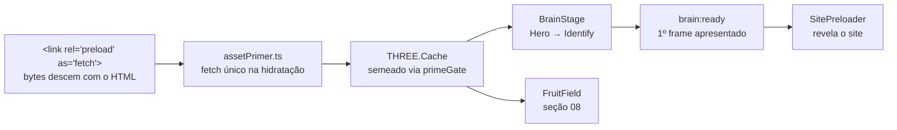

<div align="center">


# Juliana Delmonte · Nutrição Comportamental

**Landing page one-page com um cérebro 3D coberto de frutas como totem vivo da marca.**

*"O problema nunca foi a sua força de vontade."*

[](https://github.com/ZIRTUNO/behavioral-nutrition-interactive-site/actions/workflows/deploy.yml)


[**Ver o site no ar (staging)**](https://jonathandelmonte.github.io/behavioral-nutrition-interactive-site/)


</div>

---

## Índice

1. [O projeto](#o-projeto)
2. [A experiência, seção a seção](#a-experiência-seção-a-seção)
3. [Identidade visual](#identidade-visual)
4. [Princípios de design](#princípios-de-design)
5. [Arquitetura](#arquitetura)
6. [Stack](#stack)
7. [Estrutura do repositório](#estrutura-do-repositório)
8. [Como rodar](#como-rodar)
9. [Deploy](#deploy)
10. [Status e pendências de lançamento](#status-e-pendências-de-lançamento)
11. [Diretrizes de desenvolvimento](#diretrizes-de-desenvolvimento)
12. [Créditos e licença](#créditos-e-licença)

---

## O projeto

Site institucional da nutricionista comportamental **Juliana Delmonte**, com atendimento presencial em Juiz de Fora/MG e online. É uma landing page de página única que conduz a visitante por uma narrativa completa, do problema ("não é falta de força de vontade") ao método (nutrição comportamental), à pessoa por trás dele e às provas sociais, e converte para uma conversa no WhatsApp.

**O público** chega quase sempre pelo Instagram ou por indicação, no celular, depois de muitas tentativas de dieta que terminaram em culpa e sensação de fracasso, e com receio de encontrar "mais uma dieta". O site inteiro é desenhado para essa pessoa: sem antes/depois, sem contagem de calorias, sem urgência artificial. **Sucesso = a visitante sentir acolhimento + autoridade e iniciar o contato.**

**O elemento central da marca** é um cérebro humano em 3D coberto de frutas: a tese da nutrição comportamental ("a fome começa na mente") tornada objeto. Ele recebe a visitante no Hero, reage ao cursor e ao toque, e viaja pela página conforme o scroll, participando da narrativa em vez de decorá-la.

A diretriz que governa todas as decisões de interação é **"vivo, mas calmo"**: a página respira o tempo todo, mas nenhum movimento deve ser *notado* conscientemente, apenas *sentido*. Em caso de dúvida sobre intensidade, erra-se para menos.

> O documento de marca (usuários, propósito, personalidade, anti-referências e princípios) vive em [PRODUCT.md](PRODUCT.md) e é a autoridade sobre qualquer decisão de produto.

---

## A experiência, seção a seção

Cada seção tem uma **linguagem de interação inédita**: nenhuma repete a gramática da anterior. O fio condutor é o cérebro, que abre a página inteiro, "esvazia a mente" ao descer e devolve as frutas no convite final.

### A viagem do cérebro

Ao rolar do Hero para a segunda seção, o canvas 3D global desloca o cérebro entre as seções girando 540°, enquanto **as frutas voam radialmente para fora**. É o esvaziamento da mente, abrindo espaço para os pensamentos da visitante:

<div align="center">

</div>

### As oito seções

| # | Seção | Linguagem própria |
|---|-------|-------------------|
| 01 | **Início** | Cérebro interativo (flutuação idle, magnetismo de cursor, hover por fruta), folhas botânicas em parallax, rails verticais |
| 02 | **Você se identifica?** | Scroll pinado: 5 pensamentos reais trocam em balões; o cérebro pousa, "pensa" (pulso físico a cada troca) e pontos de interrogação caligráficos derivam ao fundo |
| 03 | **Como funciona** | "A madrugada que germina": o céu escuro amanhece com o scroll, vagalumes fogem do cursor e um caminho dourado se desenha, germinando os 3 princípios do método |
| 04 | **Sobre Juliana** | Spread editorial com arte aquarela, retrato emoldurado por arco de vinhas vivas, folhas que se desprendem, poeira dourada que evita o ponteiro |
| 05 | **Depoimentos** | Scrolljack horizontal: trilho cinematográfico com pilhas de polaroids expansíveis, vídeos em loop, pull-quotes e mural de avaliações |
| 06 | **Atendimento** | Mergulho em profundidade: câmera CSS 3D atravessa os 4 passos do acompanhamento (sem WebGL, só `perspective` + `preserve-3d`) |
| 07 | **Dúvidas** | FAQ encenado como conversa no chat com a Juliana: a visitante "envia" a pergunta, vê o typing e recebe a resposta |
| 08 | **Vamos conversar** | As 36 frutas do cérebro flutuam em gravidade zero ao redor do convite, reagindo ao cursor com física de meio viscoso |

<table>
<tr>
<td width="50%">

<br><b>02 · Você se identifica?</b><br>
<sub>O cérebro pousa e cada pensamento se forma num balão de vidro ("II de V: Eu mereço esse chocolate. Mas depois eu vou me odiar.").</sub>
</td>
<td width="50%">

<br><b>03 · Como funciona</b><br>
<sub>O amanhecer chega com o scroll e a semente desenha o caminho do método, princípio a princípio.</sub>
</td>
</tr>
<tr>
<td width="50%">

<br><b>04 · Sobre Juliana</b><br>
<sub>Spread editorial: o texto contorna o arco de vinhas (via <code>shape-outside</code>) e o "Juliana." dourado ganha um brilho de ouro polido.</sub>
</td>
<td width="50%">

<br><b>07 · Dúvidas</b><br>
<sub>Nada de acordeão: as objeções viram uma conversa, com fichas enviadas, typing indicator e respostas que sobem em foco.</sub>
</td>
</tr>
<tr>
<td width="50%">

<br><b>05 · Depoimentos</b><br>
<sub>O scroll vertical vira travessia lateral: peças em profundidades diferentes (parallax por <code>data-depth</code>), foco por sino de proximidade e mural de avaliações no arremate.</sub>
</td>
<td width="50%">

<br><b>06 · Atendimento</b><br>
<sub>A câmera mergulha pelos 4 passos (1ª consulta, plano, retornos, resultado) em CSS 3D puro, com trilho de progresso clicável.</sub>
</td>
</tr>
</table>

### O convite final

Na última seção, o GLB do cérebro é **reaproveitado sem nenhum download extra**: só os nós de fruta são extraídos e soltos num campo de gravidade zero atrás do copy. O cursor age como uma mão que afasta as frutas por proximidade; cliques emitem um anel de pressão no meio viscoso:

<div align="center">

</div>

### Mobile de verdade

Nada é escondido no celular: cada seção tem uma **re-encenação própria**. O Hero é dimensionado em `svh` para nunca ser cortado pela barra do iOS, a seção 02 vira dois atos empilhados, os depoimentos mantêm o scrolljack, e um atalho flutuante de WhatsApp acompanha o miolo da jornada. Há ainda uma banda dedicada para **celular deitado** (`orientation: landscape` + `max-height: 520px`), onde os layouts altos se rearranjam lado a lado.

<div align="center">
&nbsp;
&nbsp;

</div>

### Navegação

O hambúrguer do header abre o **Índice**, um overlay com as oito seções numeradas. O mesmo botão se transforma em "X" para fechar qualquer overlay ativo (índice, vídeo em tela cheia ou pilha de fotos), sempre priorizando o que estiver aberto:

<div align="center">

</div>

---

## Identidade visual

A paleta parte de um verde profundo de consultório-jardim, aquecido por off-whites e pontuado por dourado discreto ([`src/styles/tokens.css`](src/styles/tokens.css)):

<div align="center">

</div>

A tipografia combina quatro famílias **self-hosted** via `next/font/local` (subset latin, à prova do `basePath` do deploy; ver [`src/styles/fonts.ts`](src/styles/fonts.ts)):

| Família | Papel |
|---|---|
| **Playfair Display** (serif, 400–700 + itálicos) | Display e headlines, a voz editorial |
| **Montserrat** (variável, 100–900) | Texto corrido, CTAs e microtipografia (peso 500 como "regular") |
| **Allura** (script) | Exclusiva do brandmark "Juliana Delmonte" |
| **Italianno** (caligráfica) | Um único glifo: os "?" que derivam na seção 02 |

Todas as imagens raster são **WebP geradas por script** (`npm run optimize:images`, ~69% de redução no total); o retrato da Juliana é WebP *lossless* por decisão de cliente.

---

## Princípios de design

- **Vivo, mas calmo.** Movimento sentido, nunca notado. Amplitudes pequenas, ciclos longos, fases dessincronizadas por elemento. Na dúvida, atenuar.
- **Uma linguagem por seção.** Cada seção estreia a própria mecânica de interação; nenhuma recicla a anterior.
- **Nada com "cara de IA".** Sem glow pulsante, shimmer varrendo ou gradiente animado em loop. As micro-interações usam a gramática autoral do site: o traço dourado que se desenha, brotos botânicos, física sutil.
- **Progressive enhancement sempre.** Sem JavaScript e sob `prefers-reduced-motion`, cada seção entrega uma versão estática digna e completa, nunca conteúdo faltando.
- **A narrativa conduz a técnica.** O efeito existe para contar a história (a virada, a companhia no caminho), não para exibir tecnologia.
- **Anti-referências explícitas:** sites de emagrecimento agressivos (antes/depois, urgência, desconto) e landing pages genéricas de template (grids de cards iguais, fade-up uniforme).

---

## Arquitetura

Next.js 14 (App Router) com uma única rota. O 3D é React Three Fiber; **toda animação é `useFrame`/`requestAnimationFrame` + matemática nativa e CSS: não há Framer Motion nem GSAP no projeto**. A gramática se repete em todas as seções: um rAF por seção, ligado/desligado por `IntersectionObserver`, escrevendo CSS custom properties ou transforms.

### O palco global do cérebro

O cérebro vive num **único canvas WebGL fixo** montado uma vez na página ([`src/components/BrainStage/`](src/components/BrainStage)). Cada seção registra um *slot* (um spacer no DOM) e o palco interpola posição/escala do cérebro entre slots em função do scroll: é assim que ele "viaja" do Hero para a seção 02 sem nunca recriar o contexto WebGL. A rotação de 540° e o êxodo das frutas são dirigidos por refs lidas no `useFrame` (nunca estado React, para não re-renderizar a cena).

### Pipeline de assets 3D

Os ~1,8 MB de assets pesados (GLB Draco + texturas WebP, HDRI, decoder Draco self-hosted) baixam **exatamente uma vez**:



- Os `<link rel="preload" as="fetch">` no layout casam byte a byte com o `fetch()` do primer (verificado por `transferSize: 0` no resource timing), sem download duplicado.
- O HDRI foi reamostrado de 1K para **512px** (~414 KB) sem perda perceptível: luz de softbox é baixa frequência e o PMREM não resolve mais que isso.
- O decoder Draco é self-hosted em [`public/draco/`](public/draco) e versionado junto do `three`.

### Prontidão e resiliência

O preloader segue o princípio **"nunca revelar sem o cérebro pintado, mas nunca prender a visitante"**:

- `brain:ready` só dispara um frame **depois** do primeiro render apresentado (shaders compilados via `<Preload all/>`).
- Bytes baixados ≠ pronto: há um grace de 4 s para a cauda de decode/compile em aparelhos fracos, um teto de 9 s e uma extensão única de 6 s se os bytes ainda estiverem descendo.
- O `ErrorBoundary` do cérebro retenta 3× com backoff (limpando os caches de loader, senão o remount repete a rejeição cacheada); perda de contexto WebGL tem watchdog que reconstrói o canvas a partir dos caches em memória.

### Qualidade adaptativa

O canvas degrada em degraus que só descem (DPR 2 + MSAA 8 → 1,75/4 → piso **nítido** de 1,5/2). O tier é espelhado em `<html data-gpu-tier>` para o CSS cortar `backdrop-filter` e trocar keyframes com blur por variantes leves em GPUs fracas. O frameloop **pausa** quando o cérebro está longe da viewport ou sob o overlay do índice. Convenção do repositório: **toda física por frame clampa/subdivide o `dt`** (passos ≤ 25 ms), porque retomadas de aba em background entregam deltas de segundos que explodem integradores explícitos.

### Vídeos de depoimento

Os loops e o lightbox falam o **protocolo `postMessage` cru** do embed do YouTube ([`src/components/video/youtube.ts`](src/components/video/youtube.ts)), em vez do wrapper oficial `YT.Player`: o handshake `listening` é reenviado a cada 250 ms até o iframe responder, eliminando por construção o estado "áudio tocando atrás de spinner congelado" que o wrapper oficial produzia em redes lentas. Os controles do lightbox (play, volume, barra de tempo) são do site, não do YouTube.

### Acessibilidade

- `prefers-reduced-motion` respeitado em toda seção, com fallback estático equivalente.
- Conteúdo íntegro sem JavaScript (gates `.enhanced` por seção).
- Focus trap compartilhado dos overlays ([`src/hooks/useDialogFocus.ts`](src/hooks/useDialogFocus.ts)) que inclui o "X" do header no ciclo de Tab; `aria-live` no fio de conversa do FAQ; overlays contêm o scroll no próprio elemento (`overscroll-behavior: contain`) em vez de travar o `overflow` da raiz, que congelava a página inteira.

### Responsividade

O design de referência foi afinado numa janela de ~1325×1300; alturas menores comprimem fluidamente via `svh` dentro de `clamp()/min()`, preservando o platô acima de ~1230 px. O orçamento de altura do Hero mobile é derivado da barra de ferramentas real do iOS (o cérebro é um canvas fixo, então não dá para "rolar para revelar" o que ela cortar). A banda landscape-short vive **no fim de cada arquivo CSS** para vencer os dois ramos de largura por ordem de fonte.

### SEO

Metadata completa com canonical absoluto, Open Graph via file convention (`opengraph-image.png`), `robots.ts`/`sitemap.ts`, e **JSON-LD** em `@graph` (LocalBusiness + MedicalBusiness, Person e FAQPage; o FAQ estruturado espelha o copy da seção 07). O deploy de staging emite `noindex` **de propósito**, como detalhado em [Status](#status-e-pendências-de-lançamento).

---

## Stack

| Tecnologia | Papel no projeto |
|---|---|
| **Next.js 14** (App Router) + **TypeScript** | Estrutura da aplicação, SSR/SSG, metadata e file conventions de SEO |
| **React Three Fiber** + **drei** | Cena 3D do cérebro (GLTF, environment, hooks de câmera) |
| **@react-three/postprocessing** | Bloom sutil no cérebro |
| **three** + **three-stdlib** | Runtime WebGL, loaders (Draco/RGBE) |
| **Tailwind CSS** + **CSS Modules** | Tokens/utilitários de base + estilo por componente (a maior parte do visual) |
| **sharp** (dev) | Pipeline de otimização de imagens para WebP |
| **GitHub Actions + Pages** | Build estático e publicação contínua |

Animação: `useFrame` + `Math.sin`/`MathUtils.damp`/molas escritas à mão, rAF + IntersectionObserver, CSS transitions/keyframes. **Sem bibliotecas de animação.**

---

## Estrutura do repositório

```
src/
├── app/                  # App Router: layout (SEO/JSON-LD/preloads), página única, robots, sitemap
├── components/
│   ├── BrainModel/       # o cérebro: cena R3F, frutas, hooks de interação, tiers de qualidade
│   ├── BrainStage/       # canvas global fixo + sistema de slots (a "viagem" entre seções)
│   ├── sections/         # as 8 seções: Hero, Identify, Method, About, Testimonials, Journey, Faq, Contact
│   ├── layout/           # Header (hambúrguer ↔ X + overlay Índice) e Footer
│   ├── video/            # player YouTube por postMessage cru + lightbox fullscreen
│   ├── polaroid/         # lightbox das pilhas de fotos dos depoimentos
│   ├── Preloader/        # tela de boot gateada pelo brain:ready
│   ├── ui/               # CTA, FAB de WhatsApp, glifo compartilhado
│   └── brand/            # brandmark
├── hooks/                # useDialogFocus (focus trap), useLeafParallax
├── lib/                  # assetPrimer (download único do 3D), site.ts (origem canônica), contact.ts
└── styles/               # tokens.css (paleta/medidas) e fonts.ts (next/font/local)

public/
├── models/               # v7_sweetspot.glb: Draco + texturas WebP (~1,2 MB)
├── hdri/                 # studio_small_03_512.hdr (iluminação)
├── draco/                # decoder self-hosted
├── fonts/                # .woff2 subset latin
└── images/, videos/      # WebP otimizados + originais de fallback

scripts/                  # optimize-images, downsample-hdri, copy-draco
art-source/               # arquivos-fonte de arte (HDRI 1k original, imagens brutas)
.github/workflows/        # deploy.yml: export estático → GitHub Pages
docs/media/               # capturas usadas neste README
```

O modelo 3D tem 5 nós de cérebro (a "semente verde" na base é elemento de marca, não fruta) e 36 nós de fruta com hover independente: bananas, blueberries, kiwis, laranjas e morangos. As listas canônicas vivem em [`src/components/BrainModel/constants.ts`](src/components/BrainModel/constants.ts).

---

## Como rodar

**Requisitos:** Node.js 20+ e npm (o CI usa Node 20).

```bash
# 1. Clonar
git clone https://github.com/ZIRTUNO/behavioral-nutrition-interactive-site.git
cd behavioral-nutrition-interactive-site

# 2. Instalar dependências
npm install

# 3. Desenvolvimento
npm run dev          # http://localhost:3000

# 4. Build + servidor de produção
npm run build
npm run start
```

Não há variáveis de ambiente obrigatórias em desenvolvimento. As de produção são definidas por quem faz o build — o workflow do GitHub Pages ou o painel do host estático:

| Variável | Efeito |
|---|---|
| `STATIC_EXPORT=1` | Ativa `output: "export"` (gera `out/`) sem prefixo de caminho — para host estático com o site na raiz |
| `BUILD_FOR_GH_PAGES=1` | O mesmo export **mais** o `basePath`/`assetPrefix` do GitHub Pages de projeto (`/<repo>`) |
| `SITE_ORIGIN` | Origem pública do deploy (canonical, OG, JSON-LD, robots, sitemap). Sem ela, cai no `github.io` do staging |
| `NEXT_PUBLIC_NOINDEX=1` | Emite `<meta name="robots" content="noindex">` — obrigatória em QUALQUER URL temporária (staging, `*.pages.dev`) |

Scripts auxiliares:

| Comando | O que faz |
|---|---|
| `npm run lint` | ESLint (config `next/core-web-vitals`) |
| `npm run optimize:images` | Regenera os WebP de `public/images` a partir dos originais (política por imagem em [`scripts/optimize-images.mjs`](scripts/optimize-images.mjs)) |
| `node scripts/downsample-hdri.mjs` | Regenera o HDRI 512 a partir do original em `art-source/hdri/` |
| `node scripts/copy-draco.mjs` | Re-sincroniza o decoder Draco de `node_modules/three` após upgrade |

> **Gotcha conhecido:** não rode `npm run build` com o dev server de pé, porque o build reescreve `.next` por baixo dele. Para checagem de tipos use `npx tsc --noEmit` (o dev server não verifica tipos).

---

## Deploy

Push na `main` dispara [`deploy.yml`](.github/workflows/deploy.yml): build estático (`BUILD_FOR_GH_PAGES=1` → `out/` com `.nojekyll`) e publicação via `actions/deploy-pages` no ambiente `github-pages`. O site de staging fica em:

**https://jonathandelmonte.github.io/behavioral-nutrition-interactive-site/**

O export é 100% estático e qualquer host de arquivos serve o site. Fora do GitHub Pages o build é `STATIC_EXPORT=1 npm run build` com output `out/`: mesmo export, sem o `basePath` (que só existe porque o Pages de projeto serve sob `/<repo>`). Numa Cloudflare Pages, por exemplo, isso e mais `NODE_VERSION=20`, `SITE_ORIGIN` e — enquanto o endereço for temporário — `NEXT_PUBLIC_NOINDEX=1` no painel.

### Checklist de lançamento (domínio definitivo)

1. Remover a linha `NEXT_PUBLIC_NOINDEX: "1"` do `deploy.yml`; o `noindex` de staging some sozinho.
2. Apontar a env `SITE_ORIGIN` para o domínio (no painel do host, ou no `deploy.yml` se o deploy for pelo GitHub Pages). É o ponto único de onde canonical, Open Graph, JSON-LD, robots e sitemap leem; sem ela o build cai no `github.io` de staging.
3. Preencher no JSON-LD ([`src/app/layout.tsx`](src/app/layout.tsx)) o `geo` (coordenadas do Perfil da Empresa no Google); o CRN real já está lá como `hasCredential`.
4. `robots.txt`/`sitemap.xml` só valem na raiz de um domínio próprio (com `basePath` saem sob `/<repo>/`, onde crawlers não olham).

---

## Status e pendências de lançamento

**Status atual: em staging, aguardando conteúdo definitivo da cliente para lançamento.**

A experiência está completa: as oito seções do índice, o pipeline 3D, responsividade (incluindo landscape-short e iOS), acessibilidade, SEO estruturado e deploy contínuo estão implementados e no ar no staging.

O que resta é **conteúdo, não engenharia**:

| Pendência | Onde |
|---|---|
| Vídeos de depoimento definitivos (os atuais são exemplos de terceiros; os finais serão *unlisted* no YouTube com embed liberado) | Seção 05 (`CASES` em [`Testimonials/index.tsx`](src/components/sections/Testimonials/index.tsx)) |
| Fotos e avaliações reais de pacientes | Seção 05 |
| Revisão final de copy pela cliente | Todas as seções |
| Domínio próprio + itens do checklist de lançamento acima | Workflow / `lib/site.ts` |

---

## Diretrizes de desenvolvimento

Para quem (humano ou agente) for evoluir o projeto, na ordem: leia [PRODUCT.md](PRODUCT.md) (marca e princípios, a autoridade de produto), depois este README (arquitetura) e então o código da seção-alvo; os comentários longos nos arquivos são deliberados e explicam decisões e gotchas no local onde importam.

Regras que protegem o que já existe:

- **Sem Framer Motion/GSAP.** A gramática é `useFrame`/rAF + IO + CSS. Novas seções devem estrear uma linguagem própria de interação.
- **Física por frame sempre clampa o `dt`** (sub-passos ≤ 25 ms). `MathUtils.damp` é estável em qualquer delta; mola explícita não é.
- **Conteúdo clicável sobre o palco do cérebro precisa de `z-index ≥ 2`.** O canvas fixo descansa em `z-index: 1` e engole cliques de quem ficar abaixo (convenção documentada em `BrainStage.module.css`). Valide interatividade com `document.elementFromPoint`, não com cliques sintéticos.
- **Não reintroduzir `useGLTF.preload` em escopo de módulo** nos chunks 3D: dispara antes do cache ser semeado e recria o download duplo. Novo consumidor de GLB/HDRI dentro de um Canvas chama `usePrimeGate()` antes.
- **Motion ambiente em `@keyframes` usa valores literais; motion interativo usa `transform` plano lendo `var()`.** Custom property registrada lida dentro de keyframe congela no valor inicial (Chrome). Os dois compõem por aninhamento de elementos.
- **Overlays novos contêm o próprio scroll** (`overflow-y: auto` + `overscroll-behavior: contain`); nunca travar `overflow` no `<html>`.
- **Imagens novas** entram nos `JOBS` de `scripts/optimize-images.mjs` e são referenciadas pelo `.webp`.
- **Não fazer faxina** de código morto ou comentários antigos por iniciativa própria: o autor os mantém como material de estudo e contexto histórico.

O repositório é um projeto de cliente mantido por uma equipe restrita; não há processo de contribuição externa.

---

## Créditos e licença

Desenvolvido por **Jonathan Delmonte** para a nutricionista **Juliana Delmonte**. A identidade visual, o modelo 3D do cérebro (`v7_sweetspot.glb`) e as artes de apoio são ativos próprios do projeto.

Código sob licença [MIT](LICENSE) © 2026 Jonathan Delmonte. As fontes distribuídas com o site (Playfair Display, Montserrat, Allura, Italianno) são licenciadas sob a SIL Open Font License.
